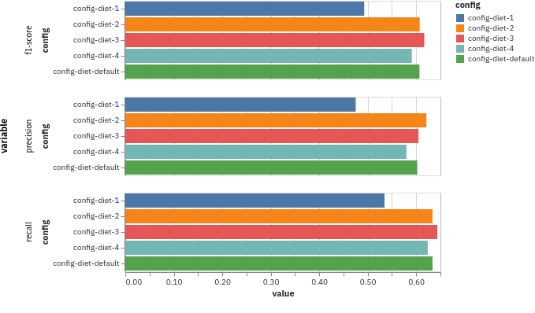
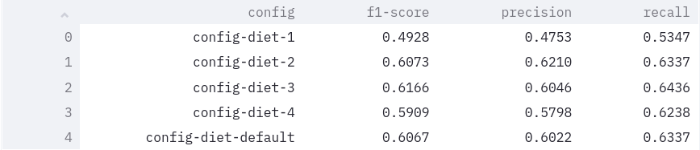
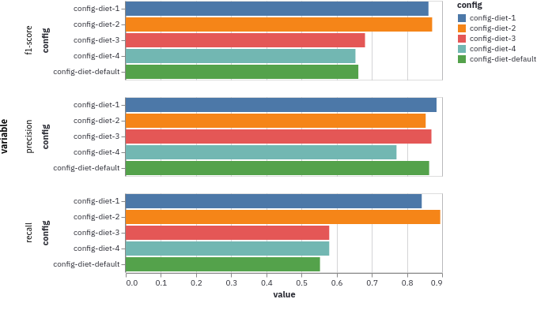
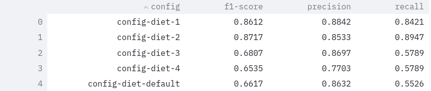

### 作业一

使用 DIET 进行意图识别及实体分类，调整 `epochs`, `weight_sparsity`, `embessing_dimension`, `transformer_size` 几个参数的值，观察这几个参数的调整对 NLU 结果的影响。

#### 实验过程

- 选取参数组合，如下表所示：

| params              | epochs | weight_sparsity | embedding_dimension | transformer_size |
| ------------------- | ------ | --------------- | ------------------- | ---------------- |
| config_diet_default | 300    | 0.8             | 20                  | 256              |
| config_diet_1       | 100    | 0.8             | 20                  | 256              |
| config_diet_2       | 100    | 0.1             | 20                  | 256              |
| config_diet_3       | 100    | 0.8             | 50                  | 256              |
| config_diet_4       | 100    | 0.8             | 20                  | 128              |

- 对 NLU 进行测试：

```python3
rasa test nlu --nlu data/nlu.yml
              --cross-validation --runs 1 --folds 2 
              --config config/config_diet/config_diet_default.yml 
              --out gridresults/diet
```

- 利用 `rasalit` 对结果进行可视化：

```python3
python -m rasalit overview --folder gridresults/diet --port 8501
```

#### 实验结果

- Intent 识别评估结果如下：





- Entity 分类评估结果如下：






综合来看，使用参数 config-diet-2 的情形下，intent 和 entity 分类的 f1-score 相对保持较高。config-diet-2 的 weight_sparsity 参数取 0.1，其他组合取 0.8或 0.9。weight_sparsity 越小，模型的效果相对更好。


### 作业二

在 rasa 工程中增加 Two-Stage-Fallback 机制。当识别用户输入意图的置信度低于 0.7 时，将重新让用户确认意图识别是否正确。如果用户 Affirm，则针对该意图回复正确的response；如果用户 deny，则请求用户重新输入，并重复 Fallback 机制。如果最后用户还是 deny，则使用 `utter_default` 进行回复。


### 作业三

增加 sentiment.SentimentAnalyzer 模块，进行用户输入的情感识别。